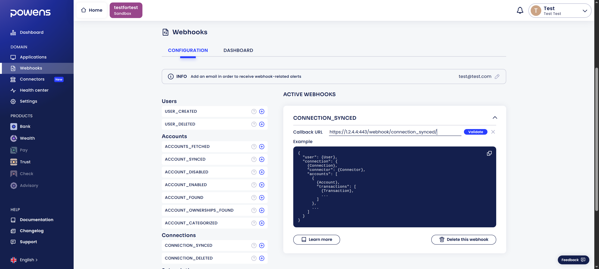

# Powens

The first thing to do to use Freenahi is to create a Powens account to get responses from its API.  
Powens is the third-party that will agregate your banking data.

???+ info
    If you want more information on Powens and how it works, please read [this page](../whatIs/powens.md).

    If needed, you can follow [Powens documentation](https://docs.powens.com/documentation/integration-guides/quick-start){:target="_blank"} to create your account.

## Create an account
Navigate to [this page](https://console.powens.com/auth/register){:target="_blank"} and create your account

You can then check your inbox, confirm your account and log in. Congratulations, and welcome to Powens Console.

## Company details
Once logged in, you will have to fill a few information about your company to create your organization.  
Here is the information to be filled in:

* company name
* company size
* country
* activity area

Your company name will be used as organization name and also to create your first workspace.

???+ tip
    Note that you can fill these fields with random data

## Crete a workspace and register your domain
From here, you need to create a workspace. Choose the name that you want, it does not really matter

Once your organization and first workspace are created, click on the creation button and choose a domain name.
The domain will be created as a "sandbox" configuration, and automatically suffixed with -sandbox.biapi.pro.  

Keep this name in mind because you will use it later for configuring the Freenahi backend.

## Create a client application
Next thing to do is to create a client application.
The definition of a client application lets you configure the associated Webview, which is the window in which you will fill you banking credentials.

You must field the name of your client application, but you can let the other fields as is.
Your client application should now appear in the list of client applications.

## Register a webhook
Powens provide us with a webhook mechanism that is the recommanded approach to be notified when new data is available. You can declare a subscription to a webhook in the console and Powens will push the data to your backend when the appropriate event occurs.

First thing to do is to register an email in order to receive webhook-related alerts in case something goes wrong

After that, we can create our first webhook.
For now, we are using only 1 webhook, **connection_synced**. Click and the + icon and add it

You need to configure the callback URL.
The callback URL is the endpoint which will be called by Powens to send the data it had aggregated from your banking accounts.  
To configure it, you need enter either your personal public IP (if you plan to host Freenahi at home) or your private domain name.
Your public IP is given by your Internet Service Provider (ISP).

???+ info
    If you are hosting Freenahi at home, you need a fixed public IP.  
    Check with your ISP if it is not the case.

    You can get your public IP at [this link](https://www.showmyip.com/){:target="_blank"}. Be sure to deactivate your VPN is you have one.

Then, you need to complete your IP with the port you want to use (80 or 443) and the endpoint of the backend which deals with this webhook: **/webhook/connection_synced/**

For example, if your public IP is **1.2.3.4** and you want to use the port **443** (default port for https), then you need to enter **https://1.2.3.4:443/webhook/connection_synced/**

## Connectors
Connectors represent business institutions that Powens can establish connections with, in order to extract data.  
For example, you have a connector with BoursoBank, American Express...
By default, only 33 connectors are activated (out of 1941 !)

You can activate every connector for simplicity in the connector tab.

## Get the credentials of your application
The last step is to get the credentials and environment variables needed by the Freenahi backend.
Currently, you need 3 of them :

* The Client ID and Client secret, available in the client application tab
* The domain name you choose earlier, available in the domain tab

Here the domain name is **testfortest**

